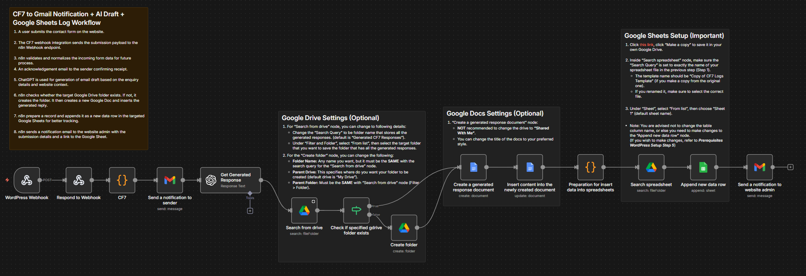

<h1 align="center">CF7 AI Inbox Automation</h1>

<p align="center">
  
</p>



<p align="center" style="margin: 1em 1em;">
  
  
  
  
  
  
  
</p>

## Problem
- Manual work: Admins needing to manage multi-domain enquiry, manually searching through website database or through emails.
- Time consuming: Admins have to write responses to user enquiry submission.

## Solution
- By referring to the **Google Sheets** logging, admins can easily tell where the enquiry comes from, the user's name, email, etc. This reduces the manual searching, and made multi-domain enquiry management better and more efficient.
- This automation pipeline captures the **Contact Form 7** submissions and draft responses using **OpenAI ChatGPT**, which helps admins to brainstorm first, before drafting an actual reply to users.

## How it works
1. A user submits the contact form on the website.

2. The CF7 webhook integration sends the submission payload to the n8n Webhook endpoint.

3. n8n validates and normalizes the incoming form data for future process.
4. An acknowledgement email to the sender confirming receipt.

5. ChatGPT is used for generation of email draft based on the enquiry details and website context.

6. n8n checks whether the target Google Drive folder exists. If not, it creates the folder. It then creates a new Google Doc and inserts the generated reply.

7. n8n prepare a record and appends it as a new data row in the targeted Google Sheets for better tracking.

8. n8n sends a notification email to the website admin with the submission details and a link to the Google Sheet.

## Prerequisites
### Requried document: 
- **Download Google Sheets Spreadsheet:** Click [this link](https://docs.google.com/spreadsheets/d/1Iq7q5FhBwew9HS1yQLePhRCaybBSfd7h0AZqDAVStj0/copy), click "Make a copy" to save it in your own Google Drive.

### Required credentials:
- OpenAI API Credential
- Google Drive OAuth2 Credential
- Google Docs OAuth2 Credential
- Google Sheets OAuth2 Credential
- Gmail OAuth2 Credential

### Setup Steps (Account Credentials)
1. Open the workflow and locate each node with an application icon.
2. Click on the node and find "Credential to connect with".
3. If a credential already exists, select it.
4. If not, click "+ Create new credential" and complete the needed steps to setup.
3. Repeat this process for all required nodes, including OpenAI, Google Drive, Google Docs, Google Sheets, and Gmail.

### Setup Steps (WordPress Contact Form 7)
1. Install WordPress plugins and activate:
   - **Contact Form 7** (by Rock Lobster Inc.)
   - **CF7 to Webhook** (by Mário Valney)

2. In your WordPress dashboard, go to  
   **Contact > Contact Forms > Contact forms 1**  
   (this form is auto-generated after installing Contact Form 7).

3. Inside **Edit Contact Form**, you will see the following tabs:
   - Form
   - Mail
   - Messages
   - Additional Settings
   - Webhook  
     *(If you don’t see this tab, make sure **CF7 to Webhook** is installed and activated)*.

4. Go to the **Webhook** tab and configure the following:
   - Enable **Send to Webhook**.
   - Fill in the **Webhook URL**:
     1. Go to n8n workflow, click inside the first node (or the node named **“WordPress Webhook”**).
     2. Copy the **Webhook URL** and set the HTTP method to **POST**.
     3. Return to WordPress and paste the copied URL into **Webhook URL**.
   - Make sure inside **Advanced settings > Method** is being set to **POST**.
   - Go to Settings > Special Mail Tag, insert tags as shown below:
     ```
     [_site_url]
     [_site_admin_email]
     ```
   - Go to **Advanced settings > Body**, insert code-snippet as shown below:
     - You are advised **NOT** to modify the value of the key value pairs.
     ```json
     {
       "sender": {
         "name": "[your-name]",
         "email": "[your-email]",
         "subject": "[your-subject]",
         "msg": "[your-message]"
       },
       "admin": {
         "website": "[_site_url]",
         "email": "[_site_admin_email]"
       }
     }
     ```
5. Note: You can add as many fields as you wish (for example, a phone number), just make sure you are adjusting the following nodes accordingly: 
   - "CF7"
     1. Modify the `init_val` and `items` variable by adding keys and values.
     2. Keys: Must be static.
     3. Values: Drag input variable corresponds to each key.
   - "Preparation for insert data into spreadsheets"
     1. Add the same key as in the "CF7" node.
     2. Set the value by referencing the variable from the previous node (for example: `sender.phone`).
   - "Append new data row"
     1. To store the value of the newly added key, first update your **Google Sheets** to match the new structure.
     2. Go to "Append new data row", locate "Values to send", and click the refresh icon.
     3. Drag the input from the previous node into the corresponding field.

6. You are all set! Trigger a test form submission to make sure the workflow processes the data correctly, generates an email draft, and automatically logs it in your Google Sheets.

7. If you are satisfied with the result, activate the workflow. From this point on, submissions will be automatically logged in your Google Sheets without any manual triggering.
(Make sure to change the *Webhook URL* from the test link to the production link in your WordPress Contact Form Webhook tab.)

## Additional Settings
### Google Drive Settings (Optional)
1. For "Search from drive" node, you can change to following details: 
   - Change the "Search Query" to be folder name that stores all the generated responses. (default is "Generated CF7 Responses").
   - Under "Filter and Folder", select "From list", then select the target folder that you want to save the folder that has all the generated responses.
2. For the "Create folder" node, you can change the following: 
   - **Folder Name:** Any name you want, but it must be the **SAME** with the search query for the "Search from drive" node.
   - **Parent Drive:** This specifies where do you want your folder to be created (default drive is "My Drive").
   - **Parent Folder:** Must be the **SAME** with "Search from drive" node (Filter > Folder).

### Google Docs Settings (Optional)
1. "Create a generated response document" node:
   - **NOT** recommended to change the drive to **"Shared With Me"**.
   - You can change the title of the docs to your preferred style.

### Google Sheets Setup (Important)
1. Click [this link](https://docs.google.com/spreadsheets/d/1Iq7q5FhBwew9HS1yQLePhRCaybBSfd7h0AZqDAVStj0/copy), click "Make a copy" to save it in your own Google Drive. *(if you haven't already)*

2. Inside "Search spreadsheet" node, make sure the "Search Query" is set to exactly the name of your spreadsheet file in the previous step (Step 1).
   - The template name should be "Copy of CF7 Logs Template" (if you make a copy from the original one).
   - If you renamed it, make sure to select the correct file.

3. Under "Sheet", select "From list", then choose "Sheet 1" (default sheet name).

- Note: You are advised not to change the table column name, or else you need to make changes to the "Append new data row" node. 
(If you wish to make changes, refer to ***Prerequisites WordPress Setup Step 5***)
